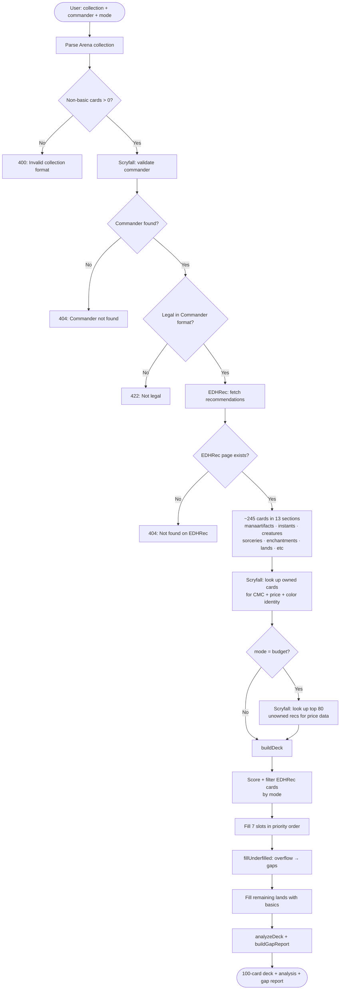
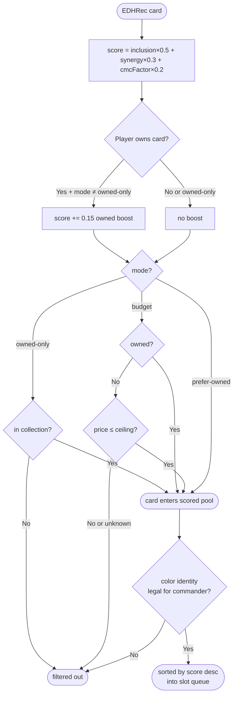
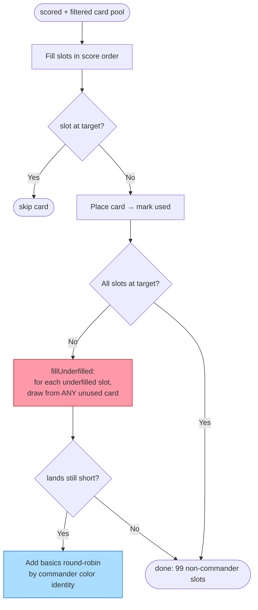
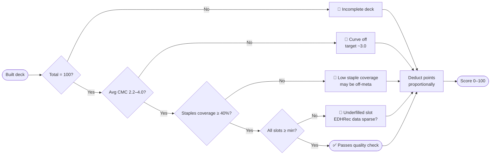

# MTG Deck Builder — Decision Trees & Quality Rubric

## 1. Build Request Flow

## 2. Scoring & Mode Decision Logic

## 3. Slot Fill Algorithm

**Slot targets (spec-defined):**

| Slot | Target | Min | Max |
|------|--------|-----|-----|
| ramp | 10 | 8 | 14 |
| draw | 10 | 8 | 14 |
| interaction | 10 | 7 | 14 |
| winConditions | 5 | 3 | 8 |
| synergy | 25 | 18 | 30 |
| lands | 36 | 33 | 40 |
| flex | 3 | 0 | 5 |

## 4. Quality Rubric (community thresholds)

---

## 5. Eval Results (2026-03-14, prefer-owned mode, small collection)

| Commander | Score | CMC | Staples% | Notes |
|-----------|-------|-----|----------|-------|
| Krenko, Mob Boss | 85 | 0.11 ⚠ | 78% | Slots perfect |
| Atraxa, Praetors' Voice | 85 | 0.23 ⚠ | 66% | Slots perfect |
| The Ur-Dragon | 85 | 0.31 ⚠ | 68% | Slots perfect |
| Muldrotha, the Gravetide | 85 | 0.25 ⚠ | 64% | Slots perfect |
| Edgar Markov | 85 | 0.16 ⚠ | 70% | Slots perfect |
| Heroes in a Half Shell | 85 | 0.22 ⚠ | 80% | New set, slots perfect |
| Sol'Kanar the Swamp King | ERROR | — | — | EDHRec 403 (old card) |
| Rhys the Redeemed | ERROR | — | — | Scryfall rate limit in batch |

**All passing commanders scored 85/100. Uniform flag: avg CMC too low.**

---

## 6. Known Issues (from eval)

### 🔴 CMC always near-zero
**Root cause:** EDHRec's cardview JSON does not include `cmc`. Non-owned cards
(~90% of a build with a small collection) get `cmc: 0` by default. The 36
basic lands also have CMC 0, dragging the average down to 0.1–0.3.

**Impact:** `averageCmc` metric is unreliable. Scoring's `cmcFactor` is also
skewed — low-CMC cards get no penalty, medium-CMC cards get unfair penalty.

**Fix options (ranked):**
1. Exclude CMC-0 cards from average EXCEPT true 0-drops (check `type_line`
   for "Land" to exclude basics, treat others as unknowns)
2. Fetch Scryfall CMC for top-N non-owned cards asynchronously and cache
3. Accept inaccuracy; surface it as "CMC data unavailable for unowned cards"

### 🟡 EDHRec 403 on some old commanders
**Root cause:** EDHRec blocks some requests without a proper browser-like
User-Agent, or the commander slug doesn't match their URL structure.
Sol'Kanar predates EDHREC's modern data.

**Fix:** Add retry with browser User-Agent; fall back to theme-based
recommendations if commander page 404s/403s.

### 🟡 Scryfall rate limit under batch load
**Root cause:** Eval runs 8 commanders sequentially, each triggering 8+
Scryfall lookups. The 100ms rate limit between calls compounds.

**Fix:** Shared rate limiter + persistent CMC cache keyed by card name.
After first lookup, CMC never needs to be fetched again for that card.
